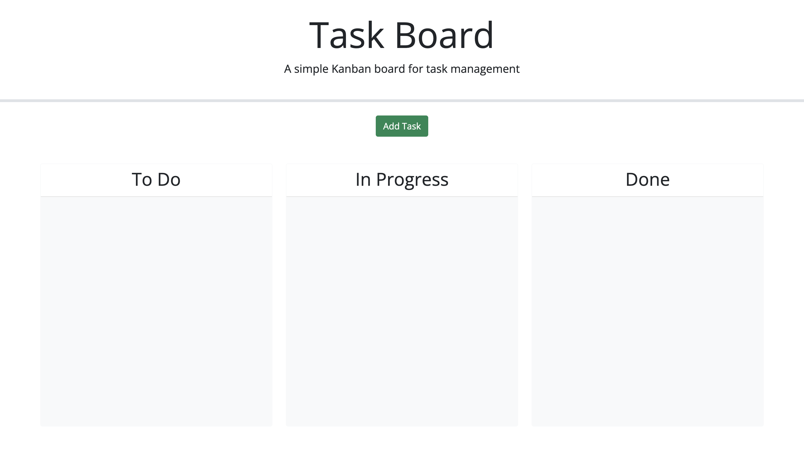
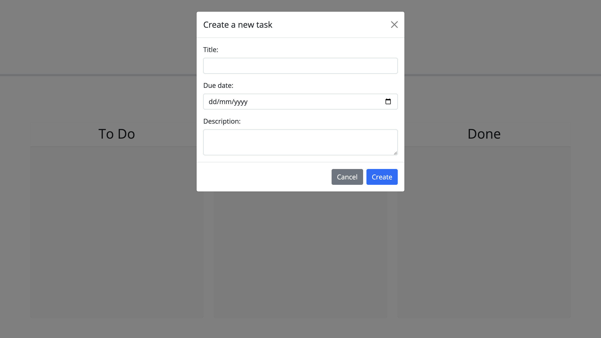
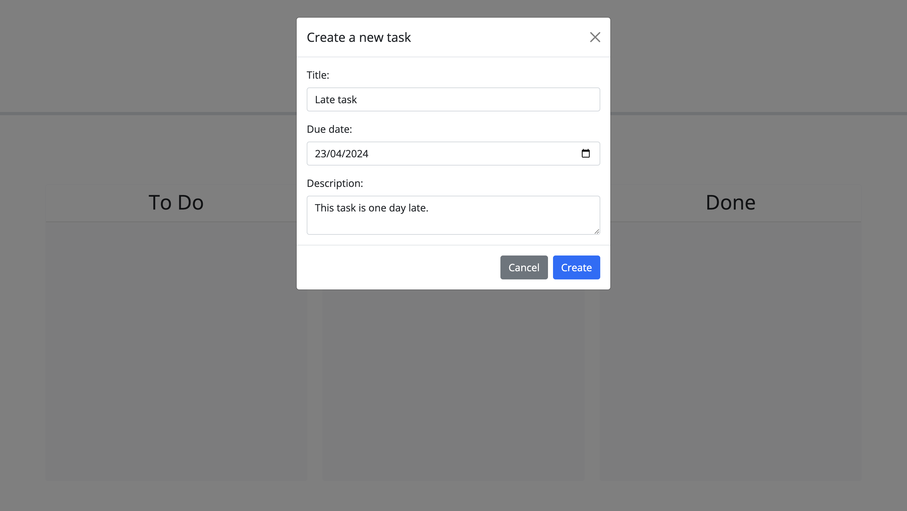
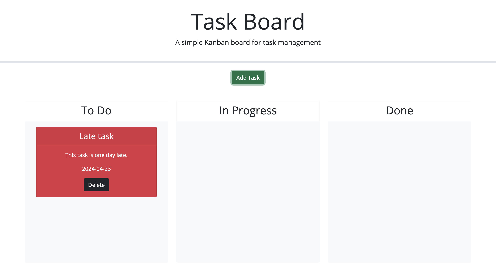
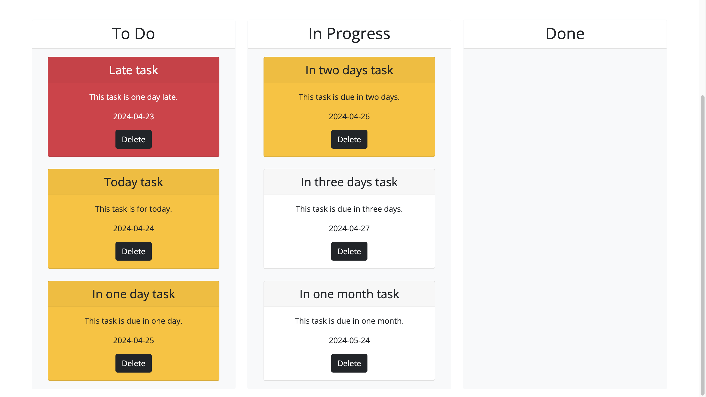
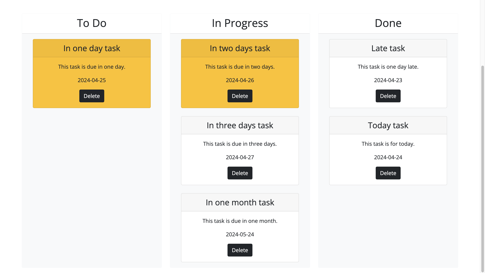
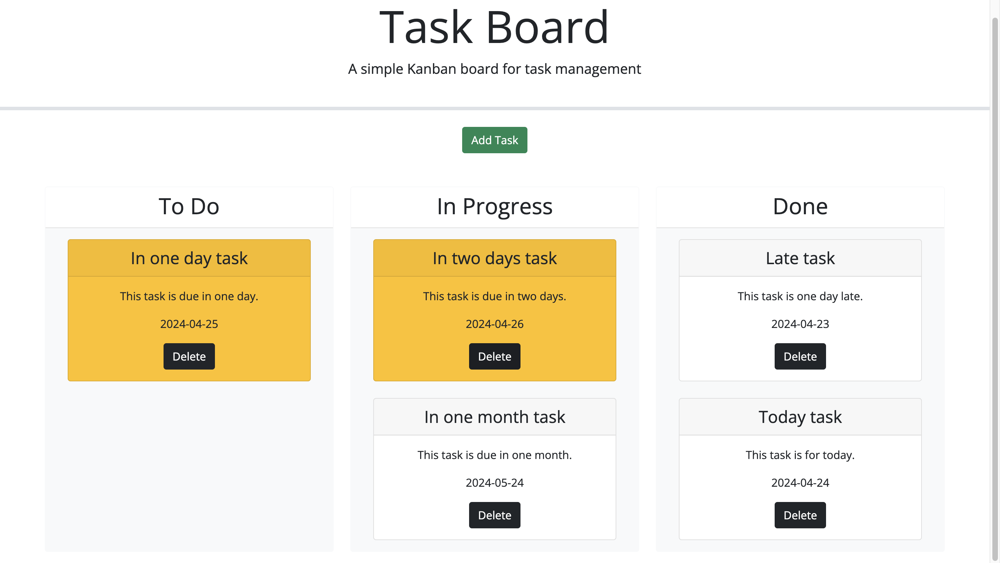

# Bootcamp module five challenge

## Description

During this project, I had to add JavaScript functions, along with the draggable and droppable interactions of the Jquery library, to the script.js file and add a Bootstrap modal window to the index.html file. I did this because the given starter files of the project did not include these features, so I had to implement them by myself. To implement them I had to read the documentation of both the Jquery and Bootstrap libraries, which was a good way to learn how to read documentation. This activity taught me that documentation is the gatekeeper of APIs, since before we use an API we have to go through its documentation first to learn how to use it.

## Installation

To use the project no installation is required, since you can access it by clicking on the following link: https://eduardovela2022.github.io/Bootcamp-module-five-challenge/

## Usage

- To access the website, click the following link: https://eduardovela2022.github.io/Bootcamp-module-five-challenge/ After clicking the link, you should see the website’s homepage.
  

- To add a task to the task board click on the “Add Task” button of the homepage. After clicking the “Add Task” button, a form to create a new task should appear. Enter the title, due date and description of the task you want to create into their respective form fields. Then click on the “Create” button to finally add it to the task board. After you click the “Create” button, the form should disappear and you should see the newly created task in the “To Do” lane of the task board.
  
  
  

- If the task’s due date is after the current date, it will appear as a red card. If the task’s due date is the current date or its due in 2 days, it will appear as a yellow card. And if the task’s due date is due in more than 2 days, it will appear as a white card.
  

- This only happens if the card is in the “To Do” or in the “In Progress” lane of the task board, since if it is moved to the “Done” lane it will appear as a white card instead. To change a card to a different lane, just click and drag it to a different lane.
  

- To remove a task card from the task board click on its “Remove” button. After you click its remove button, the card should disappear from the task board.
  

## Credits

The following resources were used to develop this project:

- Unique ID generation:

  - Nesin, A. (2023, June 20). How to generate unique ids in JavaScript. Nesin Technologies LLP. https://nesin.io/blog/generate-unique-id-javascript

- Jquery draggable interaction:

  - OpenJS Foundation. (n.d.-a). Draggable. jQuery UI. https://jqueryui.com/draggable/#default
  - OpenJS Foundation. (n.d.-b). Draggable Visual Feedback. jQuery UI. https://jqueryui.com/draggable/#visual-feedback

- Jquery droppable interaction:

  - OpenJS Foundation. (n.d.-c). Droppable. jQuery UI. https://jqueryui.com/droppable/
  - OpenJS Foundation. (n.d.-d). Droppable Photo Manager. jQuery UI. https://jqueryui.com/droppable/#photo-manager

- Bootstrap buttons, cards, and modal window:
  - Thornton, J., & Otto, M. (n.d.-a). Buttons. · Bootstrap v5.3. https://getbootstrap.com/docs/5.3/components/buttons/
  - Thornton, J., & Otto, M. (n.d.-b). Cards. · Bootstrap v5.3. https://getbootstrap.com/docs/5.3/components/card/#about
  - Thornton, J., & Otto, M. (n.d.-c). Modal. · Bootstrap v5.3. https://getbootstrap.com/docs/5.3/components/modal/#live-demo

## License

This project is under the MIT license.
